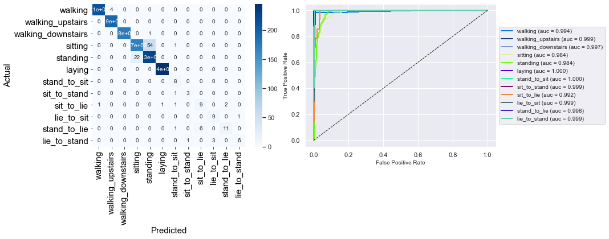

# Gait classification using smartphone sensors

I used a simple architecture LSTM network to produce activity classification using raw signals from accelerometer and gyrometer of a smartphone.
This can de used to enchance people mobility
### Raw data processing
### Visualization of activities for one subject
  + That might be an error in the processing of raw data since there are many non-labelled sequences. It might be also caused by technical check of the user while doing the record, which are not labelled (something like 'sensor/signal check by operator').

### Training metrics
  Train/val loss steadily decreasing. However, Fscore is rather low because of low occurence classes.

### Evaluation
There might be an error in the ROC (to be confirmed). Data imbalance can bee seen in confusion matrix numbers


# Data 📊
Data used in this project were created by
```
Jorge L. Reyes-Ortiz(1,2), Davide Anguita(1), Luca Oneto(1) and Xavier Parra(2)
1 - Smartlab, DIBRIS - Università degli Studi di Genova, Genoa (16145), Italy.
2 - CETpD - Universitat Politècnica de Catalunya. Vilanova i la Geltrú (08800), Spain
har '@' smartlab.ws
www.smartlab.ws
```
They can be downloaded [here](http://archive.ics.uci.edu/ml/datasets/Smartphone-Based+Recognition+of+Human+Activities+and+Postural+Transitions).

# To be done next 🛠
- [ ] Data balancing and re-training.
- [ ] Scripts.
- [ ] User classification.
- [ ] 3D trajectory reconstruction and visualization.
- [ ] Hyperparameter optimization.
- [ ] Training and evaluation metrics check. 
